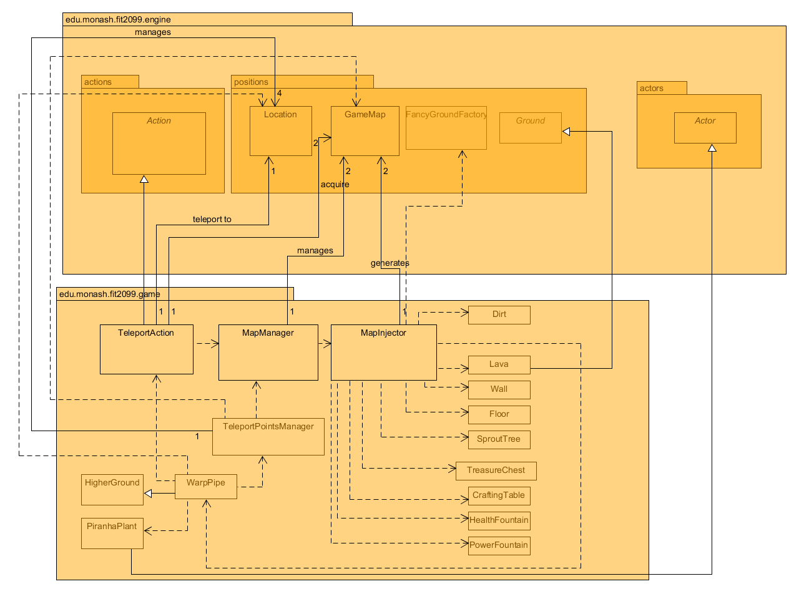
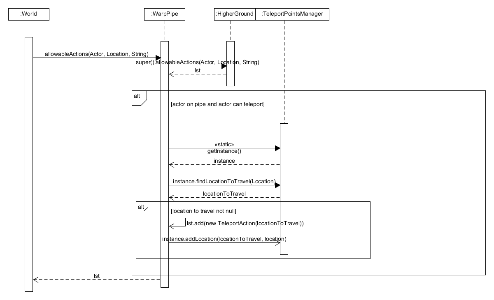
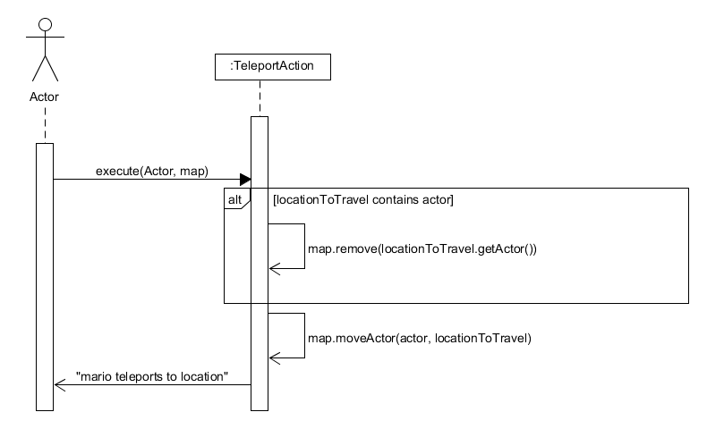

# REQ 1: Lava Zone - Design Rationale

For reference, here are the class diagrams and sequence diagrams.

## Class Diagram

## Sequence Diagram

## Rationale  
I designed the REQ such that there exists a TeleportPointsManager and MapManager where both are singleton. 
This will ensure that every object in this file shares the manager and will be updated when one object
updates it. This concept is very useful as maps and teleport points should be stored in one class so that 
classes such as Warp Pipe or Teleport Action can acquire it easily when required.

Essentially, I designed it so that WarpPipe is not required to have so many responsibilities to find where to teleport but instead, have
a tp manager to let it know where to teleport to. The tp manager then passes a location to be teleported to and warp pipe then passes it to teleport action
where it will move the actor to the correct location. This all follows the SRP. 

### TeleportAction Class
Purpose: Moves the actor to the new location when called  
<b><u>Single Responsibility Principle</b></u>: Followed, since it only moves the actor  
<b><u>Open-Closed Principle</b></u>: Followed, since we only extended from the Action abstract class and did not modify any of the 
source code  
<b><u>Liskov Substitution Principle</b></u>: None  
<b><u>Interface Segregation Principle</b></u>: None    
<b><u>Dependency Inversion Principle</b></u>: None  

### TeleportPointsManager Class  
Purpose: A global Singleton manager that stores and adds teleport points throughout the map   
<b><u>Single Responsibility Principle</b></u>: Followed, since it only manages all the teleport points   
<b><u>Open-Closed Principle</b></u>: None  
<b><u>Liskov Substitution Principle</b></u>: None  
<b><u>Interface Segregation Principle</b></u>: None  
<b><u>Dependency Inversion Principle</b></u>: None  

### MapManager Class  
Purpose: A global Singleton manager that manages all the map and map names respectively  
<b><u>Single Responsibility Principle</b></u>:  Followed, as it stores maps and map names and provides them when any class requires it  
<b><u>Open-Closed Principle</b></u>: None  
<b><u>Liskov Substitution Principle</b></u>: None  
<b><u>Interface Segregation Principle</b></u>: None    
<b><u>Dependency Inversion Principle</b></u>: None  

### MapInjector Class  
Purpose: It reduces dependencies for the MapManager class and creates all the game maps, and their names respectively!  
<b><u>Single Responsibility Principle</b></u>: Followed, it's only responsibility is to generate game maps, and their names as well.  
<b><u>Open-Closed Principle</b></u>: None  
<b><u>Liskov Substitution Principle</b></u>: None  
<b><u>Interface Segregation Principle</b></u>: None    
<b><u>Dependency Inversion Principle</b></u>: None   

### WarpPipe Class  
Purpose: It will create and provide the teleport action as a possible action to the player when there is a location to teleport to  
<b><u>Single Responsibility Principle</b></u>: Followed, it's only responsibility is to add teleport action as a possible action
to player if there is a location to teleport to  
<b><u>Open-Closed Principle</b></u>: Followed, it is extended from HigherGround class and does not modify any of the code from
HigherGround class. In addition, if it overrides a method, it calls the super of it and adds new features to it, following the 
open for extension, close for modification principle.  
<b><u>Liskov Substitution Principle</b></u>: None   
<b><u>Interface Segregation Principle</b></u>: None     
<b><u>Dependency Inversion Principle</b></u>: None   

### Lava Class
Purpose: New grounds for the player to interact with that deals damage when they step on it  
<b><u>Single Responsibility Principle</b></u>: deals damage when the player steps on it  
<b><u>Open-Closed Principle</b></u>: None   
<b><u>Liskov Substitution Principle</b></u>: None  
<b><u>Interface Segregation Principle</b></u>: None    
<b><u>Dependency Inversion Principle</b></u>: None  

### Changes from Assignment 2 to Assignment 3  
For the map generation, instead of creating it in the Application class, it is created in the MapInjector class.
This allows our Application to have lesser responsibilities. Furthermore, our maps are files instead of being in the class
as arrays. It makes it easier to see as well. Our Maps can also be accessed easily through the MapManager depending on which map 
we would like to use by putting the respective map enum as the key.