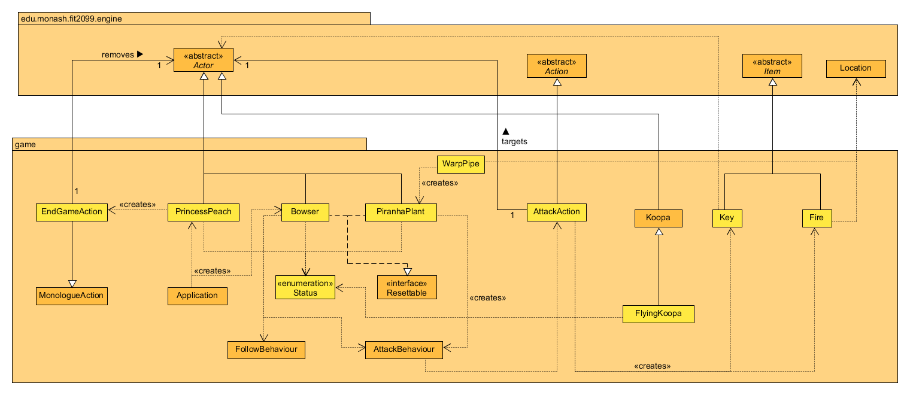
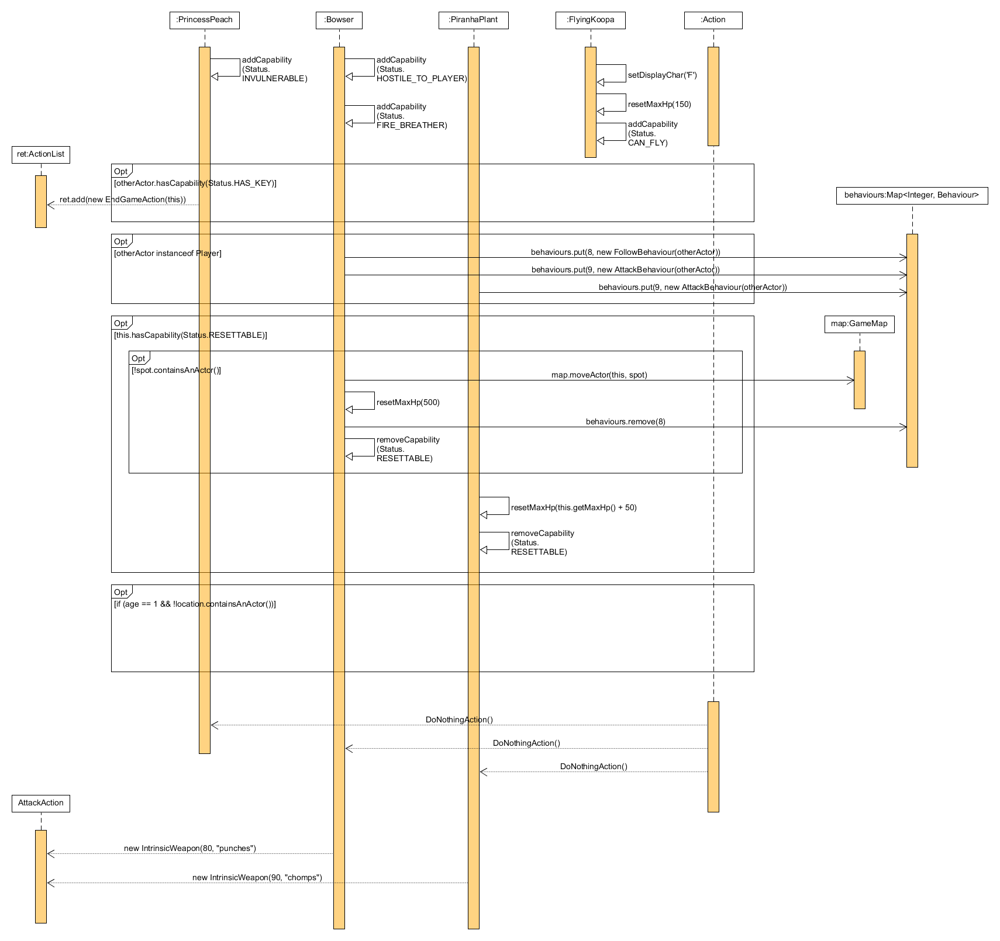
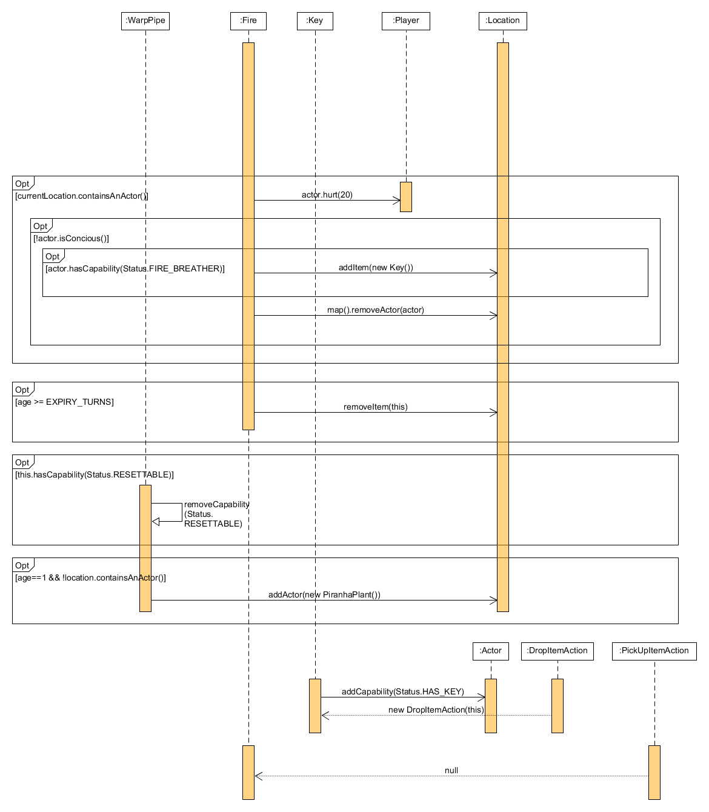

# REQ 2: More allies and enemies! Design Rationale

For reference here are the class and sequence diagrams.

## Class Diagram

## Sequence Diagrams

## Rationale

Since Princess Peach cannot attack or be attacked, I decided to give her an 'INVULNERABLE' status which allows
the program to check if the target has this status before attacking it. On her turn, since she cannot move, I 
had her always return a new DoNothingAction() using the playTurn method. As for my implementation of what happens
when you interact with her, one of my approaches was to have the program loop through the Player's inventory and 
look for an instance of the Key, however this approach uses too much code, hence I went with my current approach,
which was to have the program check the Player for a 'HAS_KEY' capability and end the game, this approach is a lot
cleaner and simpler.

The game ends with the EndGameAction class called, where Princess Peach thanks the Player, a victory message 
appears, and the Player is removed from the map, which ultimately ends the game.

One of my approaches for implementing the fire dropped by Bowser is by having the fire damage the actor in
AttackAction, however this would give the AttackAction class too much responsibility as it already handles all
the attacks dealt by the Player and all the enemies in the game, thus violating the Single Responsibility Principle.
My new approach was to let it have its own class to contain all the code, instantiate it in the AttackAction class, 
and damage the Player using the tick method. The method checks whether the current location of the fire contains 
an actor and if so, burns the actor. Other than that, the method also checks if Bowser is killed by his own fire 
to ensure that he drops the Key, allowing the Player to end the game. The method also keeps count of how many 
turns have passed to ensure that the fire only lasts for 3 turns.

The way I reset Bowser was by utilising the existing reset classes from REQ 7 in the previous assignment. Other than
having the program check if Bowser had the 'RESETTABLE' status on his turn, I also had the program check if Bowser's
original spawn location contained an actor which would most likely be himself if he didn't move. Then, I moved
Bowser back to his original position, reset his HP and removed the FollowBehaviour from him to make sure
he did not follow the Player even after reset unless the Player is within his attack range again.

How I made Piranha Plant spawn was by using the tick method to keep track of the "age" (turns passed) of the 
Warp Pipe and spawn it on the second turn in the Warp Pipe class. The same method is also used to reset the age 
of the Warp Pipe to 0 if the Warp Pipe has the 'RESETTABLE' status and if there is no Pirahna Plant in it, to 
ensure that it respawns on the second turn again after reset. Otherwise, the Pirahna Plant gains 50 hit points 
which is done by once again checking if it has the 'RESETTABLE' status in its own class and resetting its hp
to its own max hp plus 50, effectively healing it back to maximum health in the process as well.

To prevent violation of the Liskov Substitution Principle, I had the FlyingKoopa class I created extend the Koopa
class, inheriting all of Koopa's attributes and methods and not overriding any of the methods. All the FlyingKoopa 
class contains is the changing of its display character, its max hp and its name. Other than that, I've added the 
capability 'CAN_FLY' to Flying Koopa to have the program allow for actors with this status to enter any higher grounds. 
I have also edited the MatureTree class to allow for a 50% chance of spawning either type of Koopa after a successful 15%
spawn rate. To deal with when FlyingKoopa dies and to not violate the DRY principle by repeating code similar to
the death of Koopa, I've changed a line in the AttackAction class that checks if the target's name is Koopa to
if the target's name contains Koopa. 
