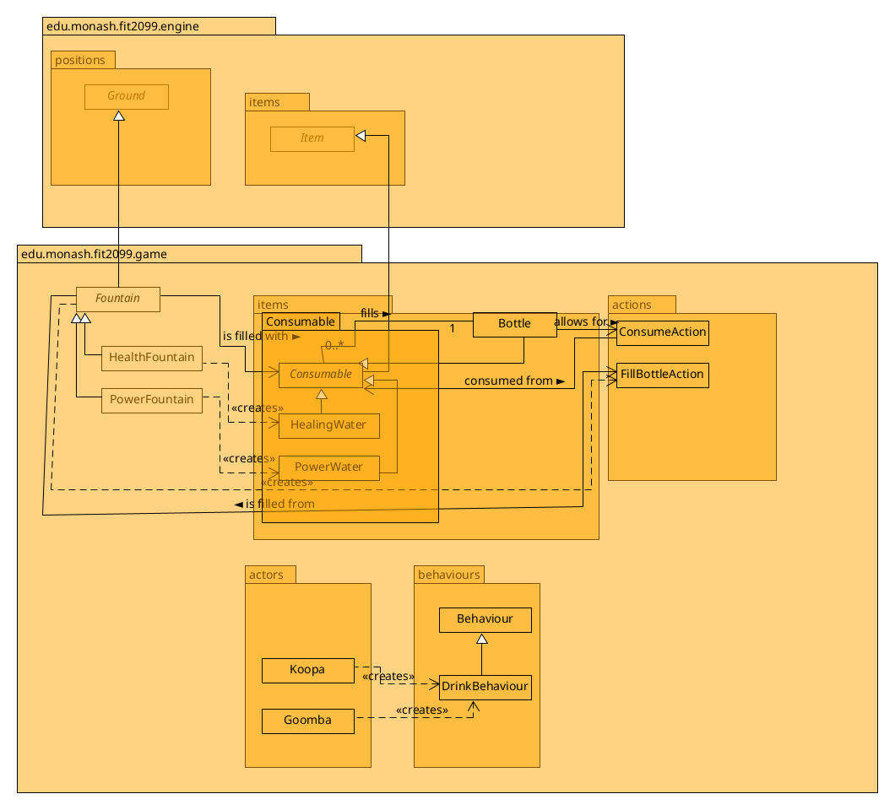
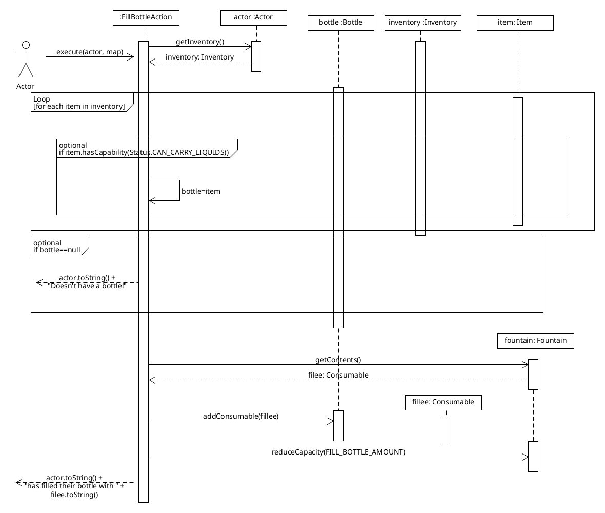
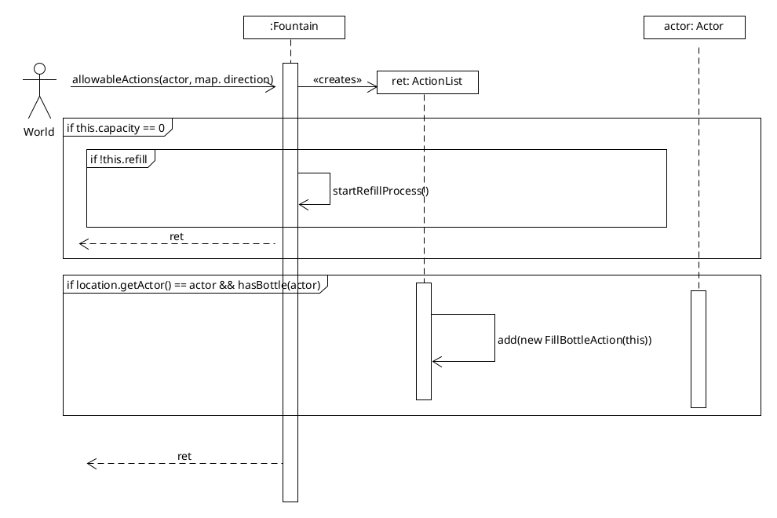

# REQ 3: Fountains

For reference, here are the class diagrams and sequence diagrams.

## Class Diagram

## Sequence Diagram

## Rationale  
I have also implemented the optional challenges, hence the Player does not start with a Bottle and instead Mario has to 
obtain the Bottle from Toad by talking to him (Select "Player talks with Toad").

### Water classes
The `Consumable` class already existed and had similar properties as the new `Power Water` and `Healing Water` would have:
They're both something you can "pick up", they have an effect when you "consume" them, they have similar menu
descriptions for the action of consuming (so we can re-use `ConsumeAction` as well), etc.

It was then very simple to have the new Waters extend from the `Consumable` class with minimal changes to `Consumable` 
itself (Had to modify from Assignment 2, so that Consumables do not necessarily give the drinker an "effect"/capability
anymore). With that change, it follows the open-clsoed principle where if I were to want to add another type of drink,
just as `PoisonWater` that hurts the player, it would be very easy to add to the game by extending `Consumable`, and
then it would work with my other classes like `Bottle` and `Fountain`s seamlessly without modifying existing classes.

A `Bottle` class (which is an Item that is place into the player's inventory) 
could then have a stack of `Consumable`s in it. Following the dependency inversion principle, it does
not rely on the two specific Water classes, instead containing a stack of the lower-level class instead, so that
if other types of water were to be added in the future, it would easily be extended just by creating a new class
extending `Consumable`, without needing to touch other classes like `Bottle`, allowing for better maintainability.
Drinking from a `Bottle` would then simply pop off the top of the stack of `Consumable`s it has, and call that consumable's
`consume` function to do the appropriate action, no matter what type of `Consumable` it is.

One downside is that in theory, it would be possible
for a programmer using this code to accidentally allow for putting food such as a into a Bottle, since the container
is for a `Consumable`. An alternative approach would be to have a `Drinkable` abstract class implement `Consumable`,
and then use that instead for the Waters, but the sacrifice of having a deeply nested inheritance tree (`Healing Water`
extends `Drinkable` extends `Item` implements `Consumable`, etc.) deemed it not worth it.

### Fountains
There was no existing class similar enough to `Fountains` as `Water` was to `Consumable`, and `HealthFountain` and
`PowerFountain` had a lot of similar characteristics (both have a "capacity" and fill up your "bottle", both are types 
of "Ground" etc.). To follow the DRY (Don't Repeat Yourself) Principle, an abstract class was created (`Fountain`) f
or the two fountains to extend.

### Drinking Behaviour
Drinking is added to certain enemies like Goombas and Koopas. If they happen to be on a fountain
ground, they would have an 80% chance ot drinking it. Since the `ConsumeAction` and `consume` function depends
on the abstraction of `Actor` instead of specifically relying on a `Player` class, it could easily substitute
the `Actor` parent class with the child `Koopa` or `Goomba` class (Liskov's substitution principle) and have
the same effect as if it were done on an Actor, for example, it would heal a Koopa or increase their base intrinsic
damage, without having any special code for Koopas/Goombas.