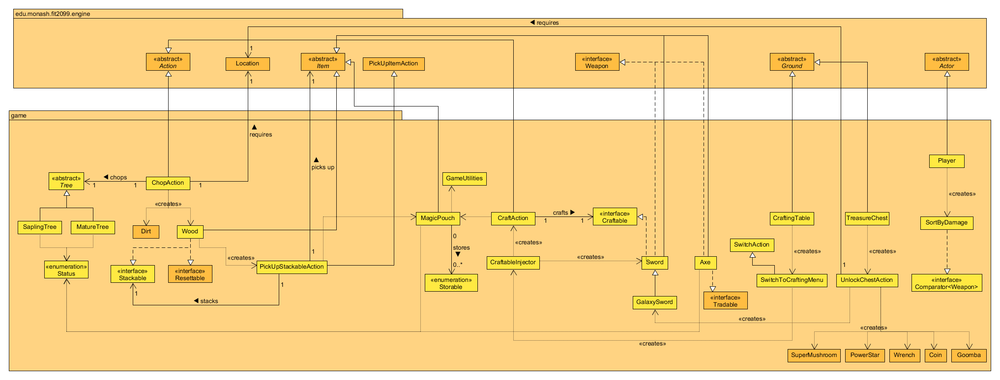
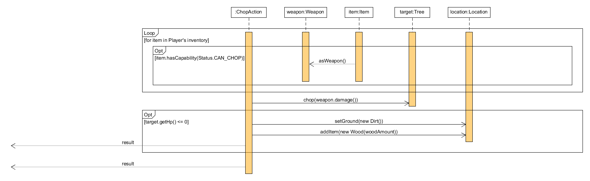
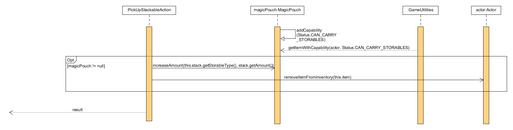
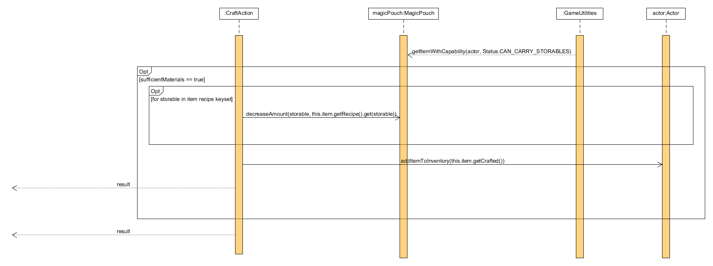
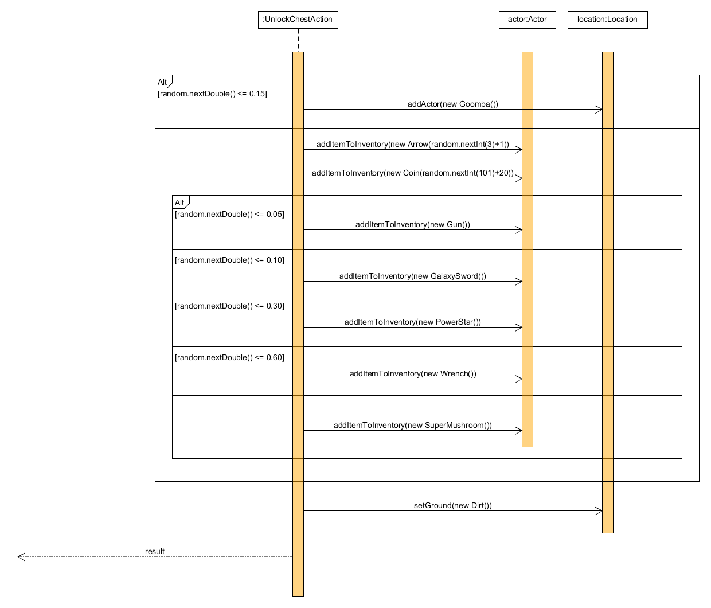
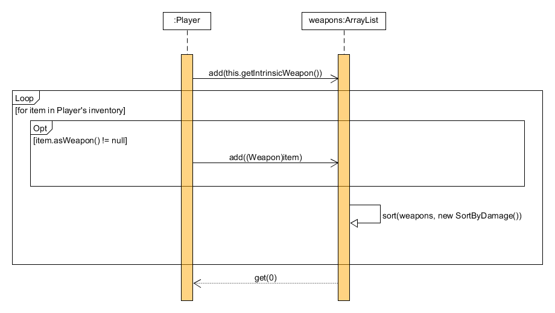

# REQ 4: Minecraft Design Rationale

For reference here are the class and sequence diagrams.

## Class Diagram

## Sequence Diagrams

## Rationale

### Chopping
To implement chopping trees into the game, we've allowed trees to have health points. Since we've
designed it so that Sprouts do not drop Wood while Saplings and Mature Trees do, We've made it
so that Saplings and Mature Trees have the capability "CAN_BE_CHOPPED" to allow the program to check
if the tree can be chopped before applying ChopAction(a new class) on it. 

ChopAction is the class used to actually chop the trees. The class utilises the execute method which
initialises the Player's punch as the main weapon for chopping, then it checks the Player's inventory
for an Axe, which is the only item in the game that has the new capability "CAN_CHOP", if it exists,
then the Player's main chopping tool switches to the Axe. The method then chops the tree, proceeding to
check if the tree's health points are below or equal to 0, and if so, will set the ground to Dirt and
drop Wood.

### Wood
As for the implementation of Wood, it was noticed that it was conceptually very similar to Coins. Both can be spawned
by Trees, both are "Items" you pick up that increases a "counter" (how much coins/wood you have), both are "spent",
either by selling or by crafting. In the previous assignment, the Coin system wasn't abstracted out, so we took 
this as an opportunity to make an abstraction, the `Stackable` interface, so that it would be 
easy to make similar items in the future in the future. (e.g: REQ5 actually uses `Stackable` again for `Arrow`s.).

Similarly, `PickUpCoinAction` needed to be refactored to a more generic `PickUpStackableAction` to allow for any
stackable to be picked up. This was done via having a parameter `Stackable` in the constructor of the action,
and because of the Liskov Substitution Principle, one can create this action and pass in any Stackable like a Coin
or a Wood item. Executing this action will then remove add to this stack as needed and remove it from the ground
if it was picked up from the ground.

Because of the different types of Stackables to be carried with similar logic, I took inspiration from the `Bottle`
class in REQ3, but for Stackables instead of Water. Like Bottles, it is an item placed into an Actor's inventory,
and with it, they can "pick up" stackable items and it'll be added to the counter. In this way, any actor with this
"MagicPouch" can have a counter of stackables in their inventory, and not just for `Player`.

The downside of this is that in order to use the `MagicPouch`, you will have to iterate over the inventory of an actor
until you find the magic pouch (checked by seeing if the item has the capability of "storing stackables"). 

One way around this is to have a `MagicPouchManager` class (which would either be a Singleton or purely static class
since there would need to be only one instance of it in the game) with a hashmap key being the `Actor`, and the value
being the `MagicPouch`. Picking up a stackable would then use this class to see if the actor picking it up
has a magic pouch, and if it does, to add it in. The reason why this approach didn't go was because of wanting
to reduce the amount of global variables as possible, which a singleton would be similar to. This would also
need really fit the conceptual idea of a "Magic Pouch" being an item that you can pick up or drop.

### Crafting
As for the implementation of crafting, we've created a CraftingTable ground that is placed next to Toad
that can be used through the CraftAction class. To avoid violating the DRY principle, all the craftable items 
implement the Craftable interface which contains methods used to get the recipes for crafting said items, 
get the crafted items and their names.

The CraftAction class utilises the aforementioned Magic Pouch and checks if the Player has sufficient materials
to craft the item from the recipe. If so, the method will craft the item and add it to the Player's 
inventory, otherwise it will display a message saying the Player's does not have enough materials.

As the menu will be more congested with options for the player to choose, we have decided that a separate menu
for the crafting would be useful and easier for the user to choose the options.

### Chests
The TreasureChest class contains a Treasure Chest ground that can be "unlocked" by the Player to 
gain surprises. It utilises the UnlockChestAction class where it takes a random generated probability
and adds the actor or item that is within the range of the generated probability to the location of 
the Treasure Chest, the Treasure Chest is that set to Dirt.

### Weapons
For the GalaxySword class, to avoid violating the DRY principle, I've made the class extend the Sword class, the
only differences being the change in display character, returned damage and its name.

Since we've added a few weapons (including the ones in creative REQ5) into the game, we've also changed the
way the program access the Player's held weapon using the getWeapon method. What we've done is first override the
getWeapon method in the Player class, create an ArrayList to store all the weapons possessed by the Player including
his Intrinsic Weapon (punch), then utilising a Comparator to sort the ArrayList by weapon damage in decreasing order,
and finally choosing the weapon at the top of the ArrayList, which would ultimately be the weapon with the highest
damage.

