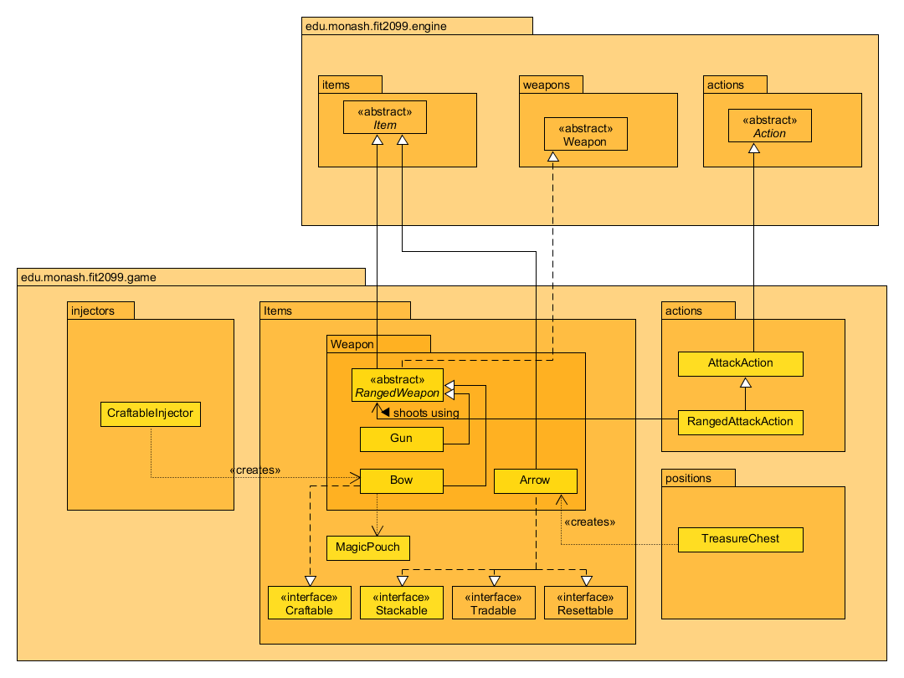
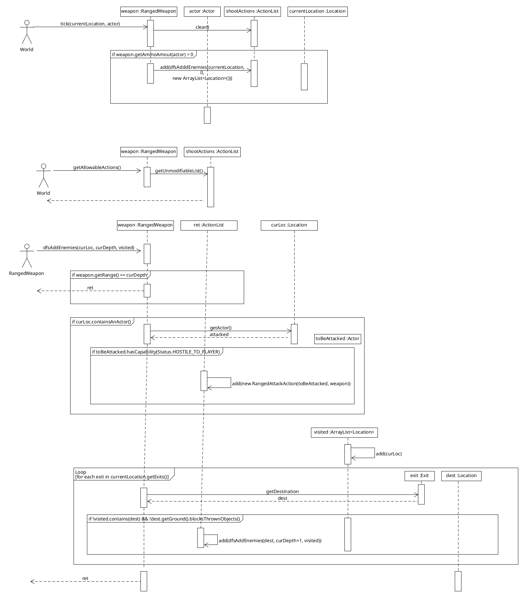

# REQ 5: Ranged Weapons

For reference, here are the class diagrams and sequence diagrams.

## Class Diagram

## Sequence Diagram

## Rationale  
A new abstract `RangedWeapon` class was created that extends `Item` and implements `Weapon`, and all ranged
weapons would then extend from this `RangedWeapon` class.

The reason for this is that ranged weapons have a common functionality between them, that is, searching for
enemies within `WEAPON_RANGE` tiles to shoot. The code for this is somewhat involved, using a Depth-First-Search to
find enemies within its range that it can reach (meaning no walls or something that can block items) and by "hiding"
this code (information hiding for unnecessary things is one of the goals of good software design)
inside the parent class as a private method, it reduces the complexity of the code since other
code does not need to concern itself with it. This DFS is the main reason for the class to exist, and so it follows
the Single-Responsibility Principle, where the only reason to touch this class would be to modify this algorithm.

Other goals of good software design includes performance and simplicity. Although having a recursive 
depth-first-search algorithm may be slightly more complex than something like checking all the tiles in the map
and checking if it's within a certain distance from the player, this would have had the performance impact
of a) Checking every tile on the map instead of just the ones you could reach and nothing is blocking the ammo 
and b) Calculating the distance for every tile. So the trade-off is considered worth it.

Classes like `Bow` and `Gun` extend this class, and don't need to worry about the code for "finding" enemies within range,
they just have to provide things like the range of the weapon, the name, etc.

Following the Open-Closed Principle, "classes should be open to extension but closed to modification",
`RangedAttackAction` extends `AttackAction`, a previous type of `Action` that we used for regular (melee) attacking.
Here, we wanted all the functionality of `AttackAction`, but wanted to extend it so that it could see enemies from
further away as well.

Arrows are similar to  `Wood` and `Coin` stacks. We can have many of those arrows, and just need a counter of how many arrows
we need, and don't specifically need specific references to those Arrow objects like `Bottle`s need to with their 
Power or Healing Water. As such, we can simply make Arrows implement `Stackable` and re-use the existing code that
allows for Stackables to pick up arrows and increment the counter for that stackable, following the "DRY" (Don't repeat
yourself) principle.
