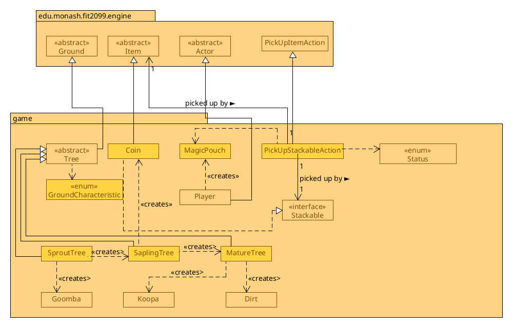
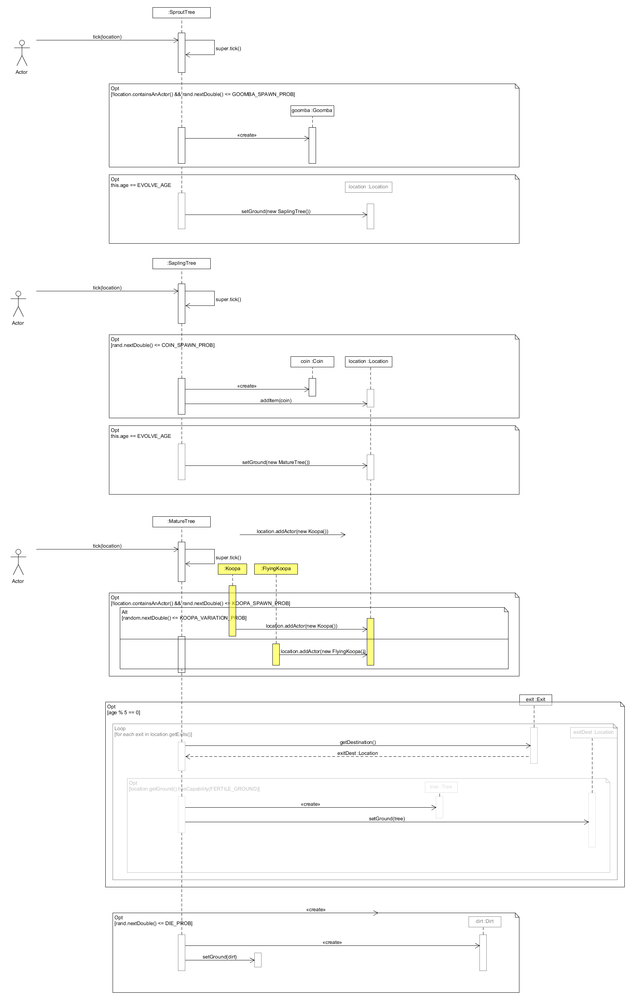

# REQ1:Let it grow! :deciduous_tree: Design Rationale

For reference, here are the class diagrams and the sequence diagrams.

## Class Diagram

## Sequence Diagram (Tree's tick method)

Note that the `<<creates>>` relations aren't necessarily needed in the diagram,
as stated on edstem that since it isn't the main focus and simply creates it
with `new Goomba()`, but I added it in for clarity.

Also note that Goomba and Koopa extends Actors, and Dirt extends Ground. I
omitted that because that portion wasn't relevant to explanation of this
design.

## Rationale

WalletKeeper is in REQ1 because REQ1 is the place where you pick up coins to earn money. The Trading REQ5 expands on this
by using this interface for buying/selling items.

A Coin extends an Item, like in the real world, it is a physical "thing" that
we can _see_ and _pick up_. In the engine, this helps us be able to re-use logic to
display the item, and pick it up, without having to worry about the
implementation details of that. Picking it up is handled by `PickUpStackableAction`, which is explained in
Ass 3 REQ 4 section.

### GroundCharacteristic
The reason for a GroundCharacteristic enum is to check for fertile grounds
on the surrounding. In the Dirt class (not pictured), the constructor would
add the capability of it being FERTILE. This way, it would be easy to extend in
the future, if we have other types of ground besides dirt that we want to be
fertile enough to grow trees on.

### Changes from Assignment 1 to Assignment 2
### Design of Tree
It was decided to go with the alternative approach with having separate classes, each extending the "Tree"  class,
for the different stages of the tree. The drawbacks are outweighted by the simplicity this new design has by
leveraging a Single Responsibility Principle, with each class being able to concentrate on its own logic for that 
specific stage of the tree. For example, now although there are more classes, there are now less dependencies on a single
class. Before, the Tree class needed to have a dependency on `Koopa`, `Goomba`, and `Coin` because it needed to spawn them.
Now, the dependency can be kept on the specific stage that is required, for example only the `SproutTree` class needs
to have a dependency on `Goomba`. The sequence diagrams for the tick() functions are a lot shorter and simpler now.

### Changes from Assignment 2 to Assignment 3
`PickUpCoinAction` was replaced by `PickUpStackableAction`, which is explained about in Ass 3's REQ 4 section.