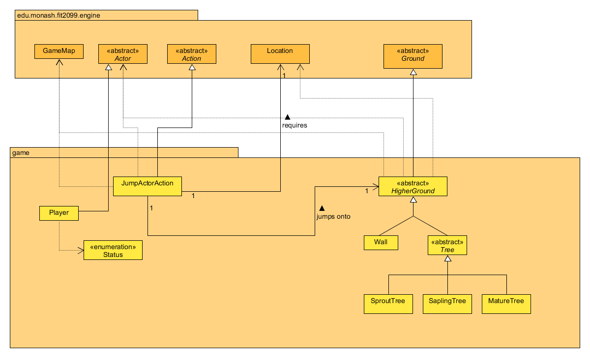
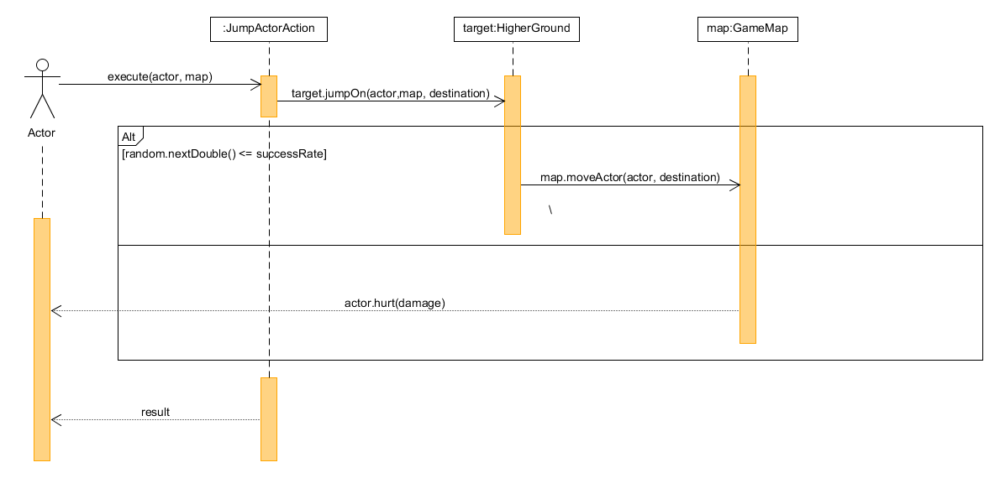

# REQ 2: Jump Up, Super Star! Design Rationale

For reference, here are the class diagrams and sequence diagrams.

## Class Diagram

## Sequence Diagram

## Rationale

My previous approach for this was to have the program check the Player's surroundings for high grounds
and give the Player to option to jump to those high grounds. However, that approach resulted in a lot
of messy and repeating code which would have heavily violated the DRY principle. 

Thus, my new approach for this was to instead have the classes Tree and Wall extend an abstract class I 
created called HigherGround so the program could identify both as one single higher ground entity
which would negate the repetition of code. The rest of the approach is similar to my previous one 
wherein when the Player chooses to jump to the high ground in the menu, the program will generate
a random probability and compare it to the success rate of jumping to that specific high ground. If
the generated probability is within the range of the success rate, the Player will successfully jump
onto the high ground, otherwise the Player will fail to jump onto the high ground and take damage
instead. All the comparisons and results occur in one method that is contained inside the HigherGround 
class called jumpOn which is called in the JumpActorAction class.
  
The JumpActorAction class is a class used to allow the Player to jump onto
high grounds. It extends the Action abstract class so that it can override 
the methods inside to allow the Player to perform a jump.
  
The JumpActorAction class should have 2 dependencies:  
1. GameMap, which is used the jumpOn method to move the Player to the specified
high ground.
2. Actor, which contains many methods that the JumpActorAction class can use to get and modify 
information about the Player.

The Location class is used by the jumpOn method to move the Player to the high ground if
the generated probability is within the range of the success rate.

The HigherGround class is a base class extended by the Tree and Wall classes to allow the program to
identify both classes as one single higher ground entity. It contains the jumpOn method which
moves the Player to the specified high ground if the generated probability is within the range 
of the success rate of jumping to the specified high ground. If the Player has the status TALL
which is granted if the Player consumes a Super Mushroom, the Player will have 100% success rate
of jumping and no fall damage.

The Player is given a status called CAN_JUMP that is used by the Tree and Wall classes allow
actors to jump onto them depending on whether the actors have the CAN_JUMP status.

### Changes from Assignment 1 to Assignment 2
None.

### Changes from Assignment 2 to Assignment 3
None.
