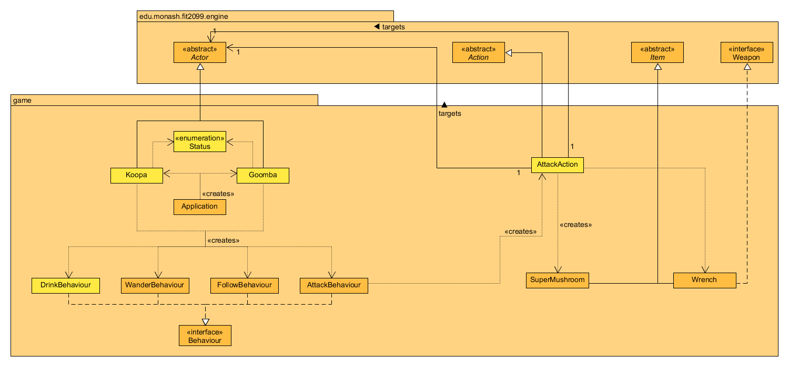
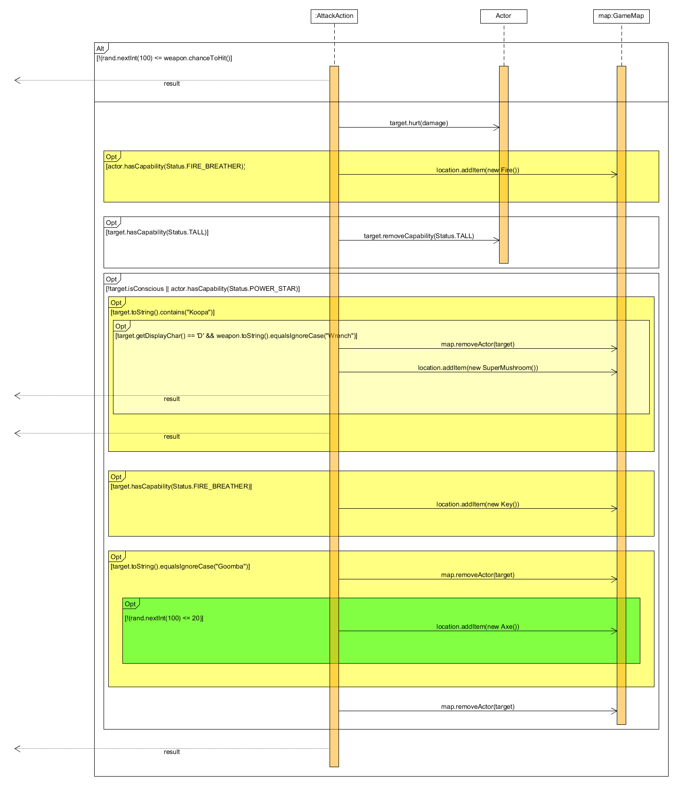
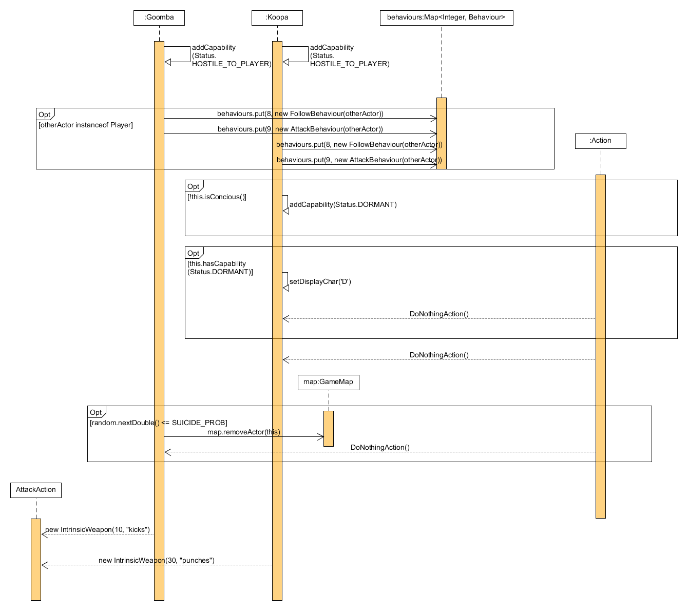
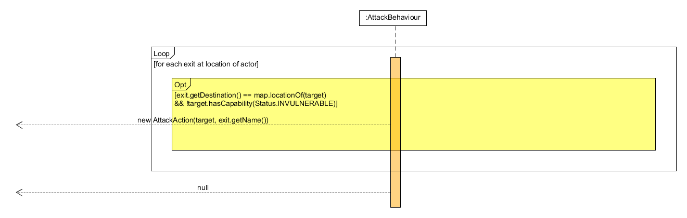

# REQ 3: Enemies Design Rationale

For reference, here are the class diagrams and sequence diagrams.

## Class Diagram

## Sequence Diagram

## Rationale

My approach for this was to create a new status in the Status enumeration class and 
add it as a capability to both Koopa and Goomba to have them attack the Player similar to
the status HOSTILE_TO_ENEMY used by the Player. Previously, I had the Koopa and Goomba utilise
the PunchAction and KickAction classes respectively which are instantiated in the AttackBehaviour 
class to attack the Player. However, this violates the DRY principle, hence I scrapped both and instead
utilised the existing AttackAction class instead. I overrided the getIntrinsicWeapons() method in both
the Goomba and Koopa classes to give them their own unique attack values. The AttackAction class is 
instantiated in the AttackBehaviour class now, replacing the previously used KickAction and PunchAction classes.
  
The Koopa and Goomba are enemies that appear in the game that can attack
the Player. The Koopa and Goomba classes instantiate the following classes:    
  
1. WanderBehaviour: It is used to allow the enemies to wander around the map.  
2. FollowBehaviour: It is used to make the enemies follow the Player if the Player
is standing next to them.  
3. AttackBehaviour: It is used to make the enemies automatically attack the Player
if the Player is standing next to them.
  
The AttackBehaviour class instantiates an AttackAction class used by enemies to attack the Player.
  
The AttackAction class which is used by the Player to attack enemies will drop
create a new SuperMushroom object after the Player breaks a Koopa shell with 
a Wrench.  
