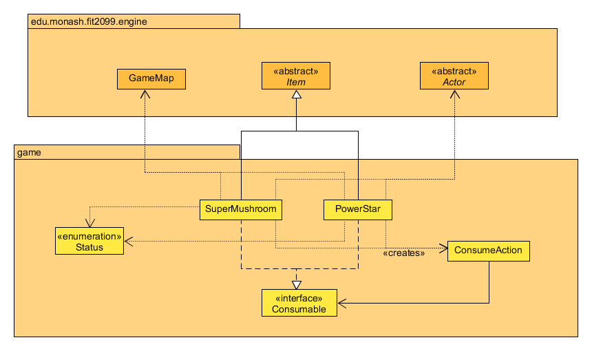
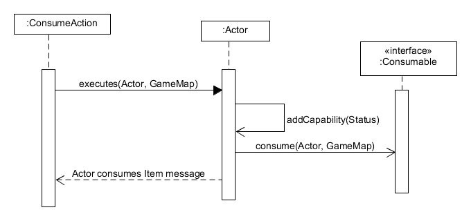
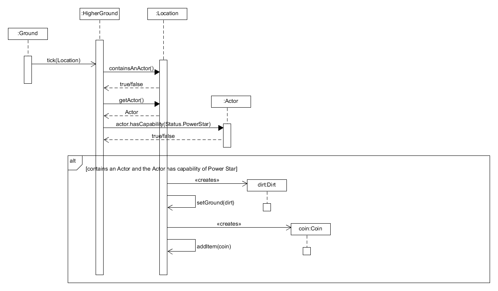

# REQ4: Magical Items :mushroom: Design Rationale

For reference, here are the class diagrams and the sequence diagrams.

## Class Diagram

## Sequence Diagram

## Rationale

The Consumable interface will have one method that need to be implemented.

2. consume(Actor, GameMap) - This will execute when the item is eaten. The
   reason for having this is that we want to allow for custom code to be run
   depending on the class implementing it. For example, PowerStar not only
   inflicts a status (perhaps called a `POWER_STAR` status, or perhaps an INVINCIBLE
   status), but also heals the player. A SuperMushroom doesn't
   only inflict a status (The TALL status given in the code), but also lets you
   increase the _max_ HP, which is different from increasing just the _HP_ like
   what PowerStar does.

A ConsumeAction was created as well to let the player eat the item. It has
an association with the Consumable that it is meant to eat.

This association with the interface follows the dependency inversion principle.
If the ConsumeAction class were to have associations instead with PowerStar
and SuperMushroom, if any other consumable were to be created, the code in
ConsumeAction would have to be updated as well, which is not ideal because we
want to minimising changing code from other classes when making such a change.

An alternate design would be to have a ConsumableItem class, that itself
derives from Item. Then, PowerStar and SuperMushroom would have to derive from
this ConsumableItem class. In fact, using this method, we can have the effect
be a protected attribute of this class instead of a method. The reason we
didn't go with this approach is because

1. It would limit the Consumables to only be Items. If we were to decide to
   have a consumable Actor in the future (Eating dead turtles and mushrooms?),
   we would have to re-design the code to account for this.
2. Not have deeply nested inheritance trees, e.g: A SuperMushroom extending a Consumable extending an Item has 3 levels
deep, and can go deeper if you want a `SuperDuperMushroom` extending a SuperMushroom.
### Changes from Assignment 1 to Assignment 2
None.

### Changes from Assignment 2 to Assignment 3
- Consumables no longer enforce an effect to be placed on the actor. This is because of new consumables added
to the game that don't force an effect on the actor.
