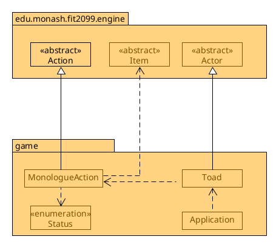
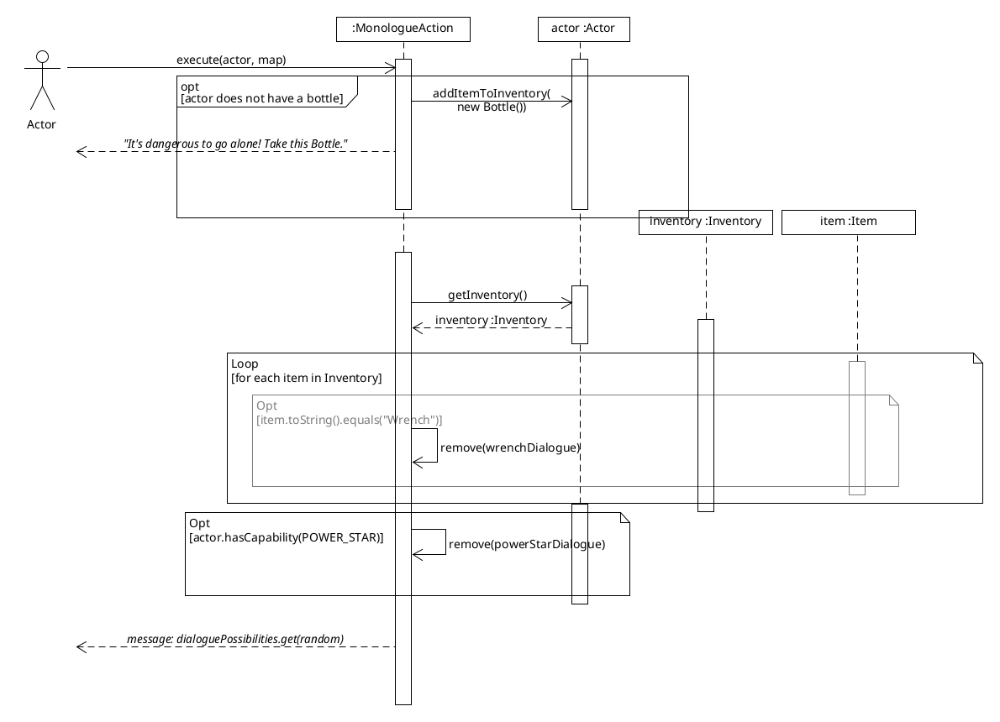

# REQ6: Monologue :speech_balloon: Design Rationale

For reference, here are the class diagrams and the sequence diagrams.

## Class Diagram

## Sequence Diagram

## Rationale

A Toad is an interactable entity that has a physical manifestation on the game
map. It extends the Actor class so that it can re-use logic and methods
elsewhere that uses the subclass Actor; For example, the
engine's World class, which uses a list of the subclass Actor to continuously
update/print out the entity's logic per game tick. which follows the DRY
Don't repeat yourself principle, as otherwise we would have to re-implement
functionality like setting up a character for how the Toad should look like,
its menu description for talking to the Toad, etc.

One downside of this is that not everything in the Actor base class is
applicable to Toad. For example, the Toad doesn't do any
fighting at all, and rather, acts as a static NPC. As such,
some methods/attributes from the subclass Actor like the health,
hitPoints, heal methods and others aren't applicable to Toad.

The dialogue options are currently hard-coded into
MonologueAction, which admittedly isn't ideal because it would be nice to
have a design where different instances of Toad (or other talkable actors)
would have different dialogues and conditions for certain dialogue to appear.
For example, perhaps having two separate Toads where one only talks about
Enemies, and another only about Enemies.

An alternative design would have MonologueAction
not hard code the dialogue, and instead have an "addDialogue" method to add a
line of dialogue. In this way, in the Toad class we can set up up the action to
talk about specific things, depending on what it was created for. The problem
with this approach is that we need to set certain conditions for certain lines
of dialogue to appear, and that is difficult to set up when adding the line of
dialogue.

For example, if we were to only want to add a line of dialogue when the actor
doesn't have a specific status, we can make the method `addDialogue(dialogueString, status)`. So for talking about invincibility for example, `addDialogue("Eat a power star to become invincible!", Status.POWER_STAR)`. But what about if we want a condition
in that an actor needs to not have an item in an inventory? Create a new
`addDialogue(dialogueString, item)` method? What about more advanced logic,
such as "You need item X but not item Y and also have status Z for this status to appear", or if we want to add other conditions not reliant on inventory and
status, such as if we want to add a condition based on the Actor's location, we
would need to have another `addDialogue` method. This is the reason that it is
currently coded in MonologueAction.

### Changes from Assignment 1 to Assignment 2
None.

### Changes from Assignment 2 to Assignment 3
Toad will now give the Player a Bottle if they do not already have one.
