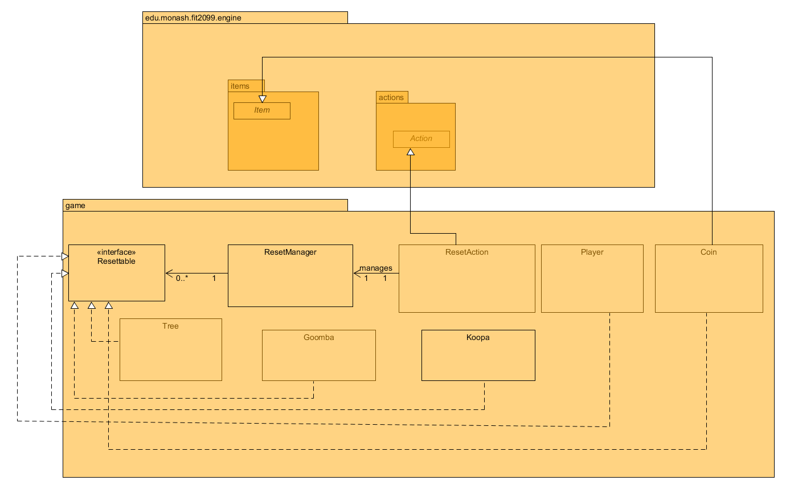
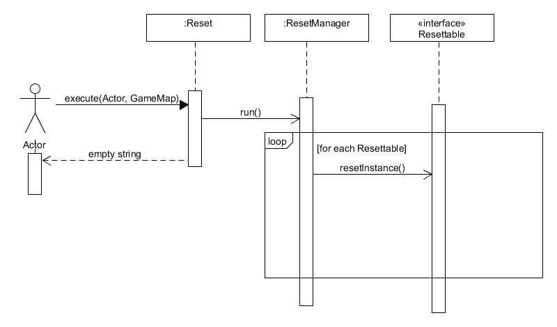

# REQ 7: Reset Game Design Rationale

For reference, here are the class diagrams and sequence diagrams.

## Class Diagram

## Sequence Diagram

## Rationale
I have created an extra class called ResetAction which extends to an Action. To keep track of the number of
times the Player can reset, I have created a counter. When Reset is run, it will reduce one on
the attribute making sure that the Reset action is not available for the Player anymore. As other classes which are 
required to reset their attributes, I have extended the Resettable interface to each of them, and all the classes will 
perform their resetting in their own implementations. This allows our ResetManager code to not have complicated code to 
reset every enemy, item, and so on. This provides extensibility for the code as the future code is only required to 
implement the Resettable interface and do their own logic in the class and not Reset Manager.

A major design flaw for this REQ is that ResetAction does not really utilize the meaning of Action. In the
execute function, it doesn’t even use the parameters given to it but instead just calls the
ResetManager to perform the resetting of instances. However, it does not seem that there is
another way to design this class since we need this Reset to be an Action so it could be registered in
the Player’s action as one of the actions available and able to reset the game. The advantage of creating
an additional class of ResetAction is that it follows the single responsibility principle whereby the Reset
Manager only manages the reset while the ResetAction class is an Action which runs the Reset Manager.

### ResetManager Class  
Purpose: A global Singleton manager that does soft-reset on the instances.  
<b><u>Single Responsibility Principle</b></u>: It manages all the Resettable instances and resets them when
the reset action is called  
<b><u>Open-Closed Principle</b></u>: None  
<b><u>Liskov Substitution Principle</b></u>: None, it cannot extend from any class due to its different
usability  
<b><u>Interface Segregation Principle</b></u>: None  
<b><u>Dependency Inversion Principle</b></u>: This principle is followed as we will call resetInstance method
on multiple classes, actions, actors and more! With a layer of abstraction, this class will only need to depend
on the Resettable interface and not the instances themselves to be reseted!  

### ResetAction Class  
Purpose: It's an action class which is used when the reset option is chosen by the player  
<b><u>Single Responsibility Principle</b></u>:  It's only responsibility is to reset the entire game  
<b><u>Open-Closed Principle</b></u>: It is extended from Action and can be modified to suit its usability!   
<b><u>Liskov Substitution Principle</b></u>: None   
<b><u>Interface Segregation Principle</b></u>: None  
<b><u>Dependency Inversion Principle</b></u>: None

### Changes from Assignment 1 to Assignment 2
None.