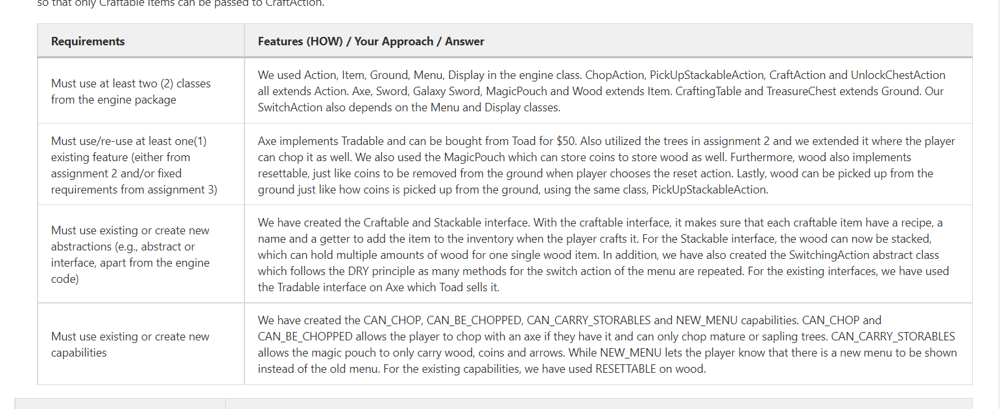
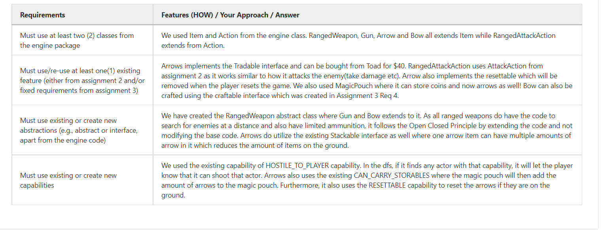

# Requirement 4

**Title**: Minecraft

**Description**: Mario can now punch trees and collect wood just like Minecraft! With wood, mario can also craft
tools to defend himself such as a sword from the crafting table! On top of that, there are treasures around the map which drop good loot
when you unlock it such as a galaxy sword! With the menu piling up with many options, the crafting menu comes in handy to provide easier focus on what the player would like to do. 

**Explanation why it adheres to SOLID principles** (WHY):
- All classes follows the SRP and will only have one sole responsibility. For instance, the chopping of a tree, the player may have an axe(to chop the tree), a chopping action, and a PickUpStackableAction when the player wants to pick up the wood. 
- The crafting of an item also follows the SRP where there is a crafting table(which the player can craft items at), and a craft action which then the item is added to the inventory!
- Open Closed Principle is also followed in the Switching of Menus. All classes which extended from the SwitchingAction does not modify the base code but instead just extends to it. For instance, the switching action can be switched to either shop or crafting menu.
- Interface Segregation Principle is followed. There are items that can be bought and items that is stackable. However, there are some items that only can be bought and not stackable, such as Axe. Thus, we split the 2 interfaces.
- Lastly, DIP is also followed. The CraftAction only needs to know the Craftable methods and not all the item's methods. Therefore, the interface Craftable was created to follow this principle so that only Craftable items can be passed to CraftAction.

# Requirement 5

**Title**:
Ranged Combat

**Description**:
Bows, arrows and guns now exist in the game! They utilize dfs to search through the enemies and finish them! Bows have a range of 5 and have arrows to shoot while guns have unlimited POWER(unlimited range and unlimited bullets)!! With these weapons, we're confident mario can one shot Bowser(who needs Peach when we got guns).

**Explanation why it adheres to SOLID principles** (WHY):
- All classes follow SRP. When the player wants to shoot an enemy, it must have a bow or gun and calls the RangedAttackAction which attacks the enemy. All classes mentioned have their single responsibility which meets the principle.
- Open Closed Principle is followed as well, where Bow and Gun extends to RangedWeapon without modifying the source code and only adds new features.

